<link rel="stylesheet" href="index.css"><header class="container">
  <h1>Confledis -Mini projet-</h1>
</header>
<body class = "secContainer">
Angular web app demonstrate the creation of a product CRUD operations.

## Technologies
* Angular (Version 11)
* NgRx library (Version 11)
* Tailwind CSS (Version 2.0)
* Redux design pattern

* ++ Backend Server ++
  * Nest js
  * MySQL
> Find the backend server [here](https://github.com/Houssem-Esprit/Confledis_miniProjet_server).

## Get Started
Download or clone the project:
```bash
https://github.com/Houssem-Esprit/Confledis_miniProjet.git
```
Install the required packages:
```bash
npm install --save or globally install: npm install -g --save
```
Run the Angular app:
```bash
npm run start
```
The app will be available on:
```bash
http://localhost:4200
```
> Feel free to change the default port (4200) in: package.json

++ Backend ++

> Make sure to download the backend server [here](https://github.com/Houssem-Esprit/Confledis_miniProjet_server).

```bash
npm install --save 
```
Config Database:
*  Install [WAMP](https://www.wampserver.com/) or [XAMPP](https://www.apachefriends.org/fr/index.html)
*  Run your database environment (wamp/xampp)
*  Access your phpMyAdmin workspace
*  Create a new database with name [confledis](https://github.com/Houssem-Esprit/Confledis_miniProjet)

Run the server app:
```bash
npm run start
```

## Screenshot


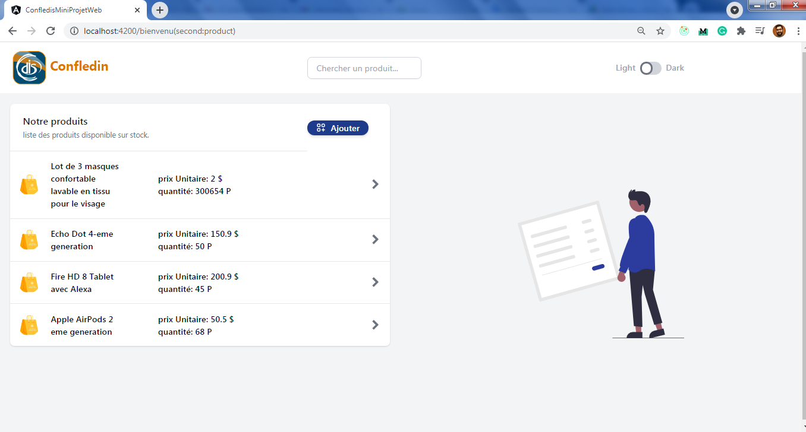 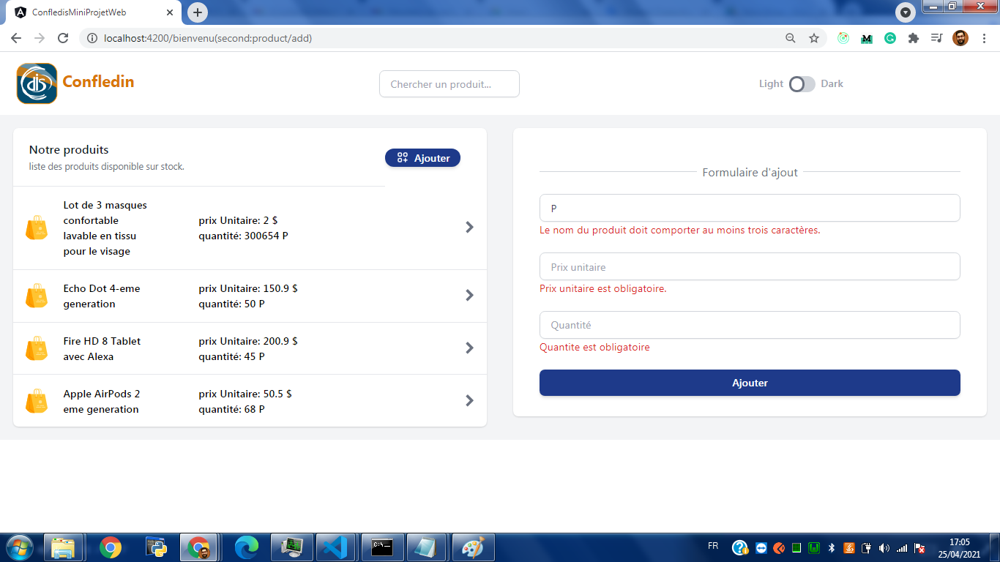
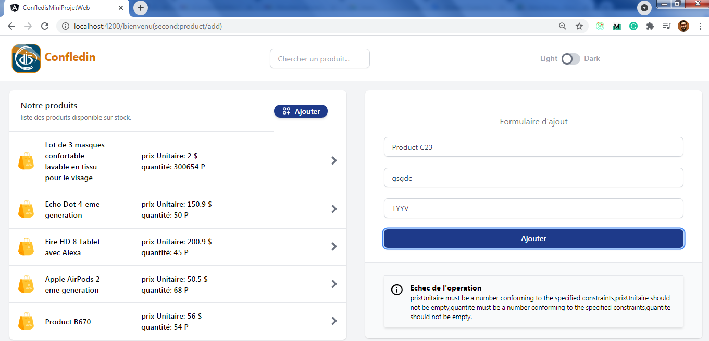 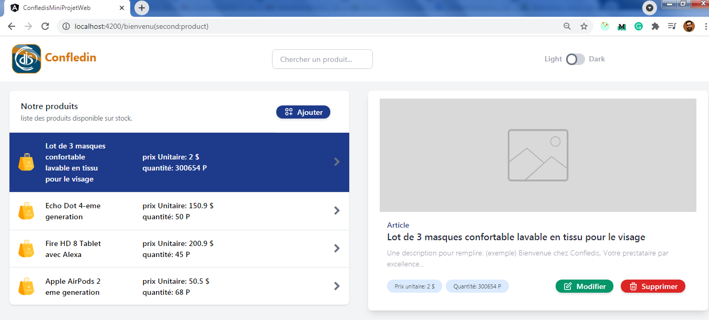
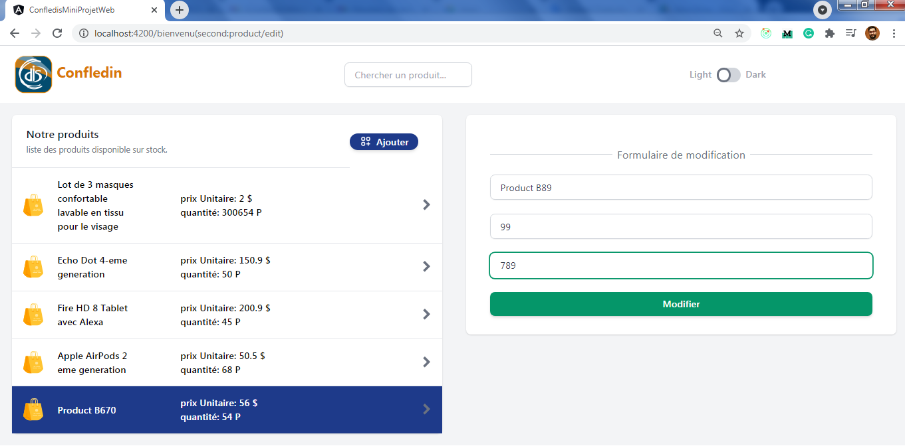 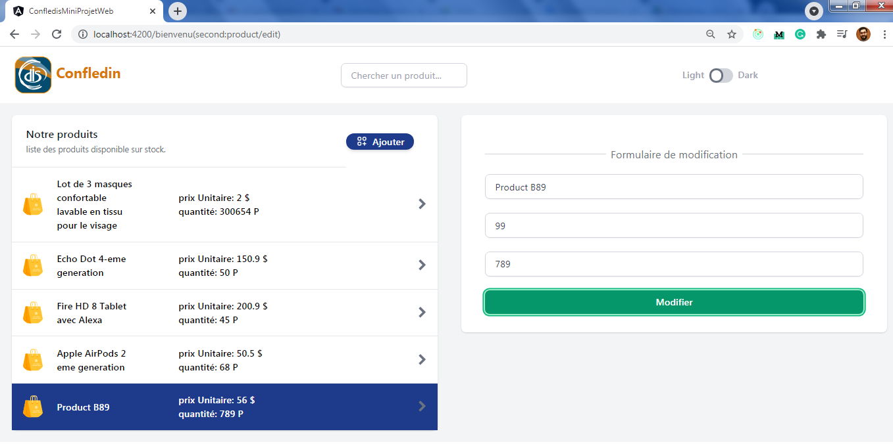
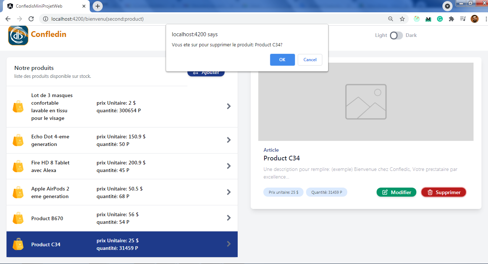 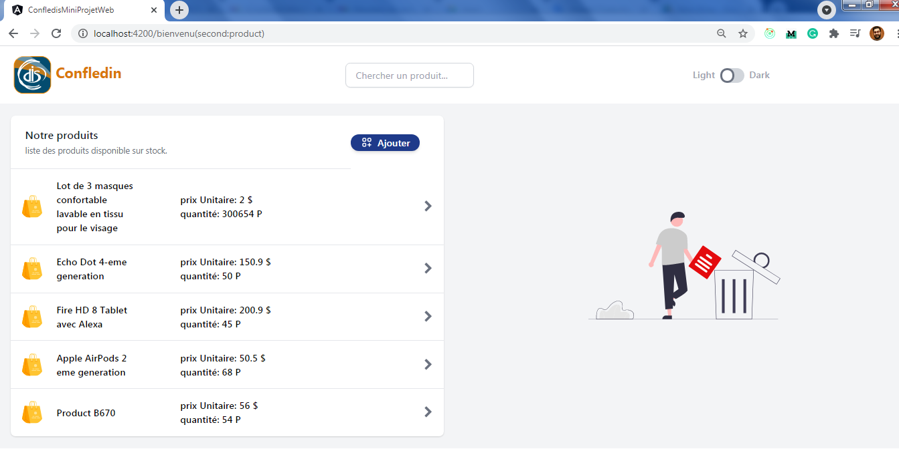
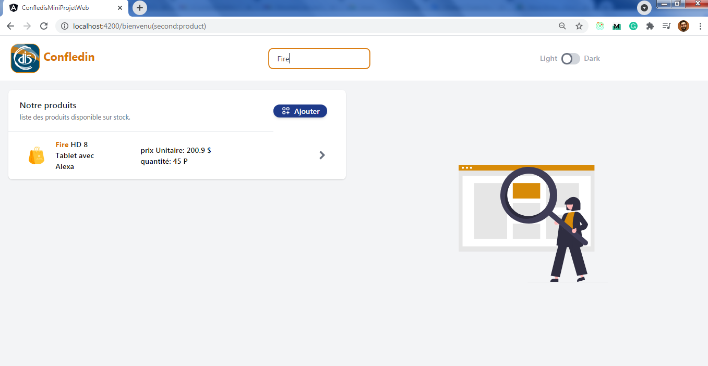 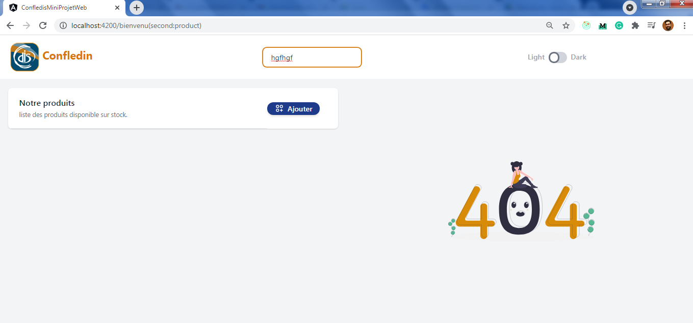
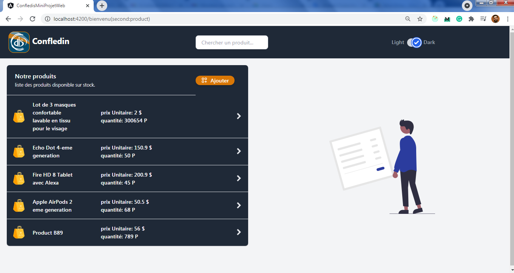 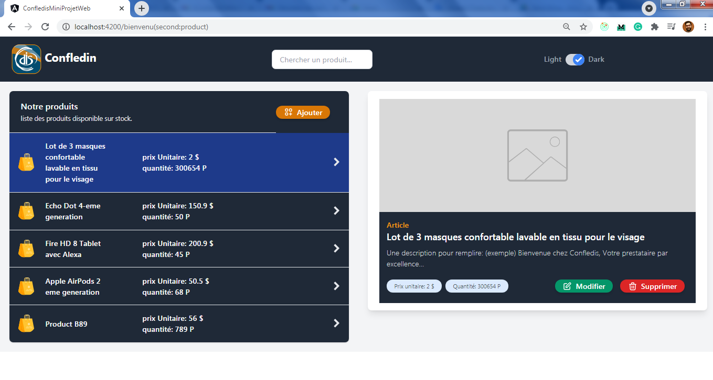
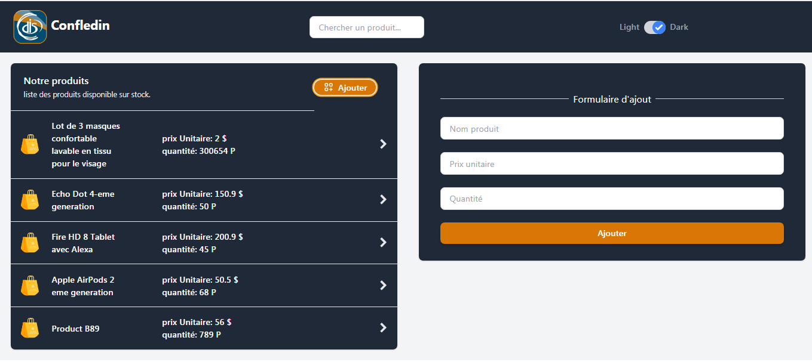 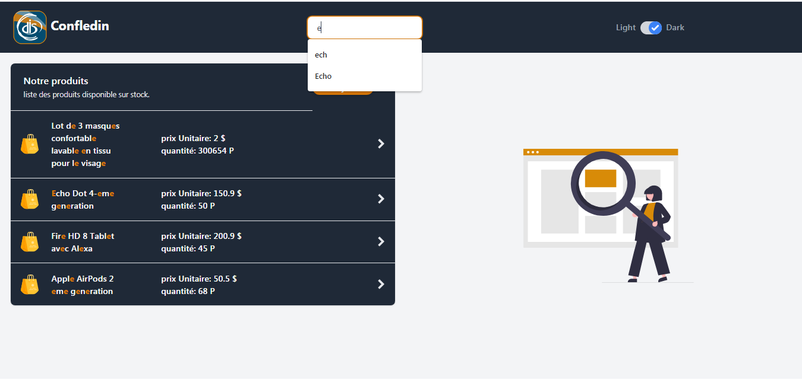

</body>
